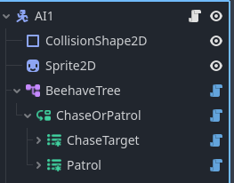

# Creating a Behavior Tree

After following the [installation guide](../README.md#📦-installation) you may have the necessary nodes to get started.

In this small introduction you will learn how to create a basic Patrol/Chase AI that follows the cursor whenever it's near, if the cursor is not nearby, it will patrol on a certain given points.

1. Create a new Scene of type `CharacterBody2D` and configure to your liking
2. Add a `BeehaveTree` node and configure the actor to the CharacterBody2D
3. Add a Selector node and rename it to ChaseOrPatrol
4. Inside the ChaseOrPatrol, add two more nodes, a ChaseTarget and a Patrol node, noth must be of type `ReactiveSequence`

By now, your tree may be looking like this:



Let's start with the chase state. In this tutorial we gonna try to keep our codebase as reusable as it can be.

## Creating the chase state
Creating the chase state requires two leafs that may be computed simultaneously (thanks to the ReactiveSequence parent node) checking if the mouse position is nearby or not:

1. Add a `ConditionLeaf` node, rename it to `isTargetNearby`
2. Since adding the node make it's use the base script let's extended the script so we can write custom logic to it
3. Right-click at the node and select ExtendScript, you may rename the script to yout liking, but for sake of reusability lets keep it as `isTargetNearby.gd`
4. Inside the script write the following logic:
```gdscript
    extends ConditionLeaf

    @export var target_string: String
    @export var distance_threshold: float

    func tick(actor: Node, blackboard: Blackboard) -> int:
        
        if actor.global_position.distance_to(blackboard.get_value(target_string)) <= distance_threshold:
            return SUCCESS
        
        return FAILURE
```
5. Add another node for the Chase state, this time, an `ActionLeaf` node, rename it to MoveToTargetPosition
6. Let's repeat the same process as before, extend the script and name it to your liking, here we are gonna keep the same name as the node
7. Here is the code for this script
```gdscript
    extends ActionLeaf

    @export var target_position_string: String
    @export var speed: float

    func tick(actor: Node, blackboard: Blackboard) -> int:
        if actor is CharacterBody2D: # Casting the actor to CharacterBody2D for code completion
            var target_position: Vector2 = blackboard.get_value(target_position_string)
            
            var dir = target_position - actor.global_position
            dir = dir.normalized()
            
            actor.velocity = dir * speed
            actor.move_and_slide()
            
            if actor.global_position.distance_to(target_position) < 60:
                return SUCCESS
        
        return RUNNING
```

Before testing the behavior you may have noticed that these script use the [blackboard](blackboard.md), so lets introduce one so we can use it

## Adding the blackboard
